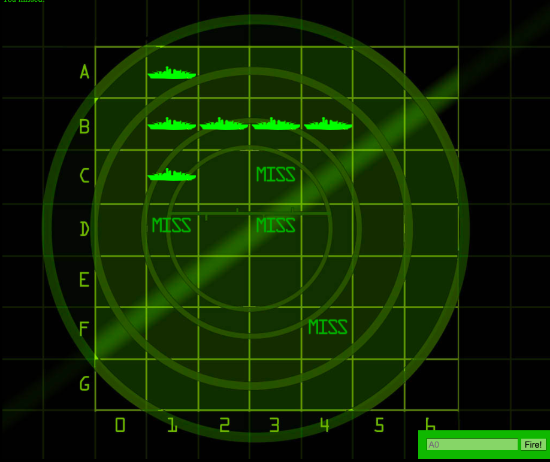

# Battleship Game

### This is a simple Battleship Application built using HTML CSS and Vanilla JavaScript
 
#### You can test the app [here](https://beethoven3579.github.io/JS-Battleship/) 

## Project Summary
This application was part of the curriculum in the Head First Javascript book that I am currently reading. This app was full of useful learning points. The most beneficial element of this project was learing to use methods within objects. This project really helped me to understand the benefits of object oriented programming. I can't wait to revisit this project for helpful insight in the future. 

## About Me
Nick Paolino -- Full-Time Programming Student -- [LinkedIn](https://www.linkedin.com/in/nick-paolino-00469291/)
